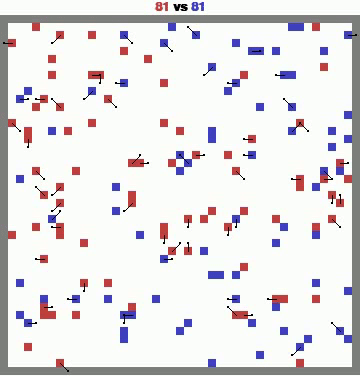

# MAgent2 RL Final Project

## Thành viên nhóm
| Họ và tên       | Mã sinh viên |
| ----------------- | -------------- | 
| Quản Xuân Sơn | 22022519     | 
| Nguyễn Tiến Trung | 22022541     | 
| Vũ Minh Khải | 22022556     | 

## Overview
In this final project, we will develop and train a reinforcement learning (RL) agent using the MAgent2 platform with Double Deep Q Network. The task is to solve a specified MAgent2 environment `battle`, and our trained agent will be evaluated on all following three types of opponents:

1. Random Agents: Agents that take random actions in the environment.
2. A Pretrained Agent: A pretrained agent provided in the repository.
3. A Final Agent: A stronger pretrained agent

## Result

  
  

## Installation
Checkout a [Colab notebook](https://colab.research.google.com/drive/1qmx_NCmzPlc-atWqexn2WueqMKB_ZTxc?usp=sharing) for running this demo.

## References

1. [MAgent2 GitHub Repository](https://github.com/Farama-Foundation/MAgent2)
2. [MAgent2 API Documentation](https://magent2.farama.org/introduction/basic_usage/)
